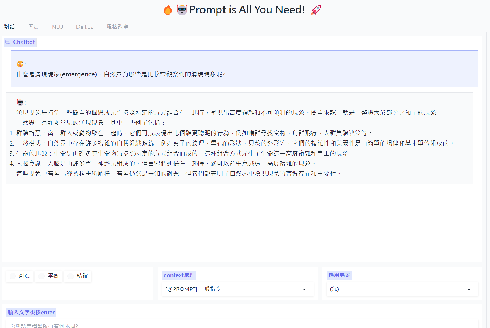
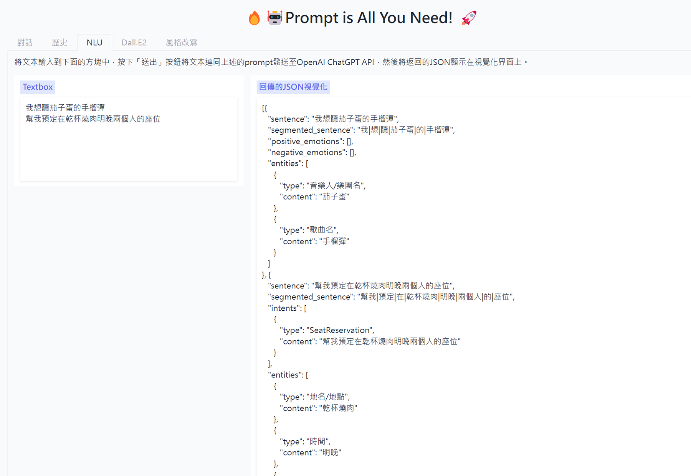

# Prompt is all you need !! #  

這個專案是我基於openai api將我的一些想法落實的實驗場
一切都會環繞在如何協助人們更有效率的運用prompt來實現複雜的任務

### 目前這個專案中已經實現了: ###
* streaming 對話
* 自動繼續(當因為字數因素中斷，會自動背景重發繼續，然後將回傳結果接在前面中斷的位置，使用者將完全沒有中斷的感覺，這是我開始這專案時最想完成的功能)
* 歷史對話紀錄自動摘要(以縮減tokens數)
* 超參數調整
* ChatGPT inside的傳統自然語言處理任務

### 目前這個專案正在實現: ###
* 更彈性的上下文管理機制，目前預計會有
    * [@PROMPT] 一般指令
    * [@GLOBAL] 全局指令(以append形式累加)
    * [@SKIP] 跳脫上文(只要全局指令，無須上文)
    * [@SANDBOX] 沙箱隔絕(連全局指令都不需要)
    * [@EXPLAIN] 解釋上文
    * [@OVERRIDE] 覆寫全局
* 更多進階的商業應用場景

### 目前這個專案未來希望實現: ###
* 儲存思維鏈以及私有知識
* 結合更多外部api