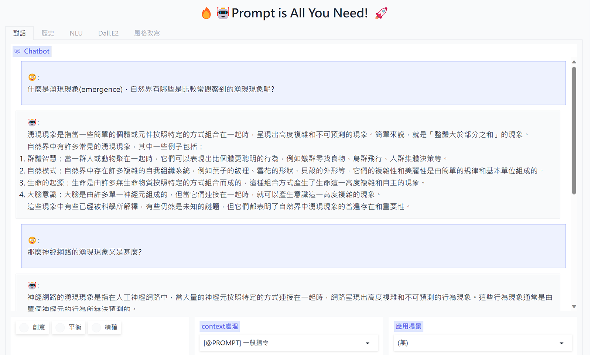
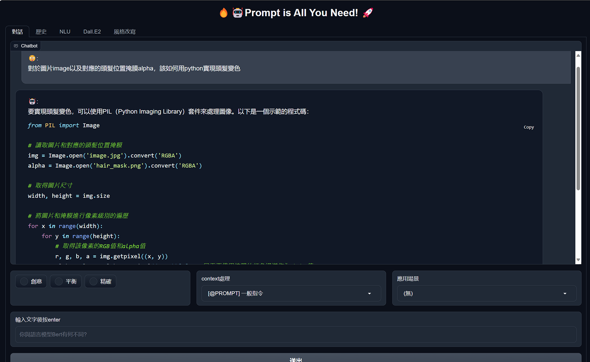
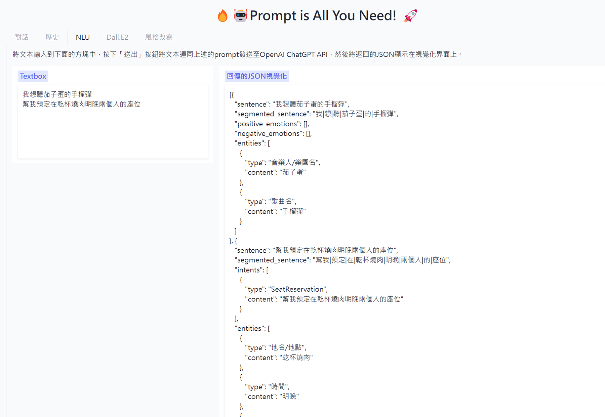
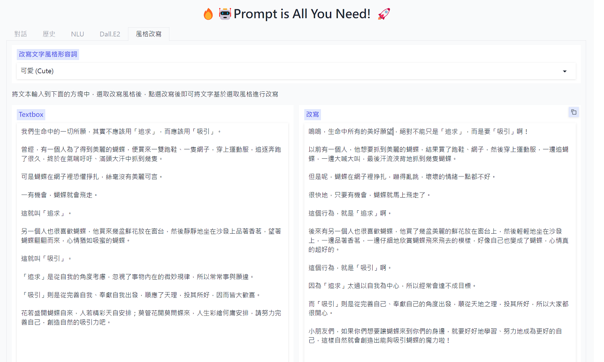
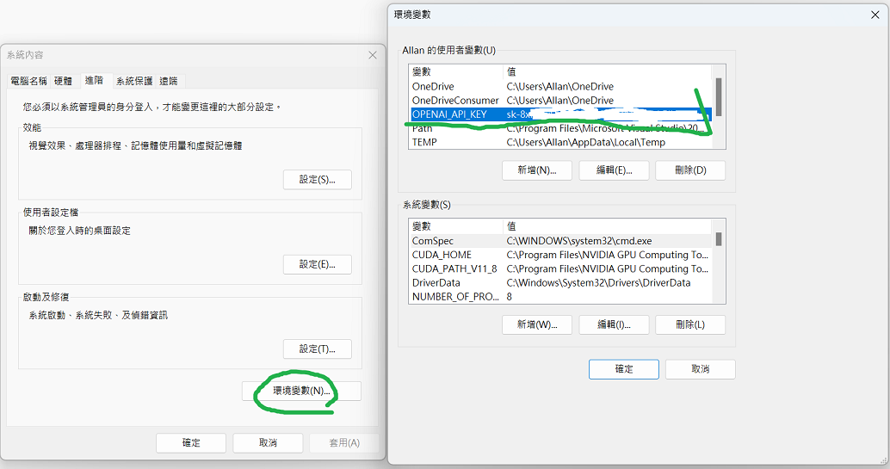

# Prompt is all you need !! #  

這個專案是我基於openai api將我的一些想法落實的實驗場
一切都會環繞在如何協助人們更有效率的運用prompt來實現複雜的任務

### 目前這個專案中已經實現了: ###
* 暗黑模式 (new)
* 將與ChatGPT交互模式抽象化(api/base_api/GptBaseApi)
* streaming 對話
* 自動繼續(當因為字數因素中斷，會自動背景重發繼續，然後將回傳結果接在前面中斷的位置，使用者將完全沒有中斷的感覺，這是我開始這專案時最想完成的功能)
* 歷史對話紀錄長文自動摘要(以縮減tokens數)
* 超參數調整
* ChatGPT inside的傳統自然語言處理任務
* ChatGPT 與Dall.E2協作
* 語氣改寫
* ~~coming soon 會議錄音自動整理!!!!

### 目前這個專案正在實現: ###
* 更彈性的上下文管理機制，目前預計會有
    * [@PROMPT] 一般指令
    * [@GLOBAL] 全局指令(以append形式累加)
    * [@SKIP] 跳脫上文(只要全局指令，無須上文)
    * [@SANDBOX] 沙箱隔絕(連全局指令都不需要)
    * [@EXPLAIN] 解釋上文
    * [@OVERRIDE] 覆寫全局
* 更多進階的商業應用場景

### 目前這個專案未來希望實現: ###
* 儲存思維鏈以及私有知識
* 結合更多外部api

### 如何開始使用: ###
透過git將本專案下載至本機，並安裝相關requirements

    git clone https://github.com/AllanYiin/Prompt_Is_All_You_Need
    cd Prompt_Is_All_You_Need
    pip install -r requirements.txt
    pip install -e .

或者是直接利用以下語法安裝:

    pip install prompt4all --upgrade

請依照指示將金鑰值賦值至環境變數OPENAI_API_KEY
執行以下語法即可啟動

    python prompt4all.app

### 金鑰值賦值方法: ###
如果您是在windows平台:
請在系統->進階系統設定->環境變數->使用者變數
中點選「新增」，在變數名稱中輸入:“OPENAI_API_KEY”
在值的部分輸入您的OpenAI API密鑰
需要重開機才能有效抓取到金鑰值

如果您是在linux平台:
輸入以下命令：export OPENAI_API_KEY=your_api_key_here 將“your_api_key_here”替換為您的OpenAI API密鑰