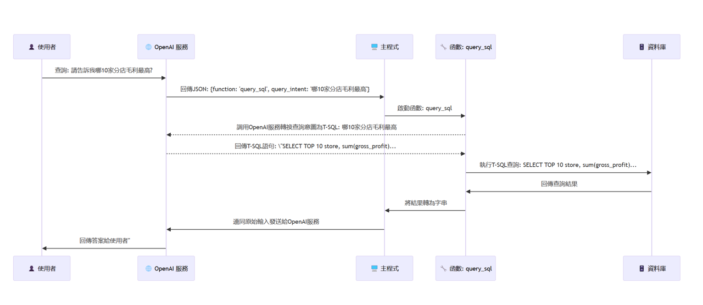
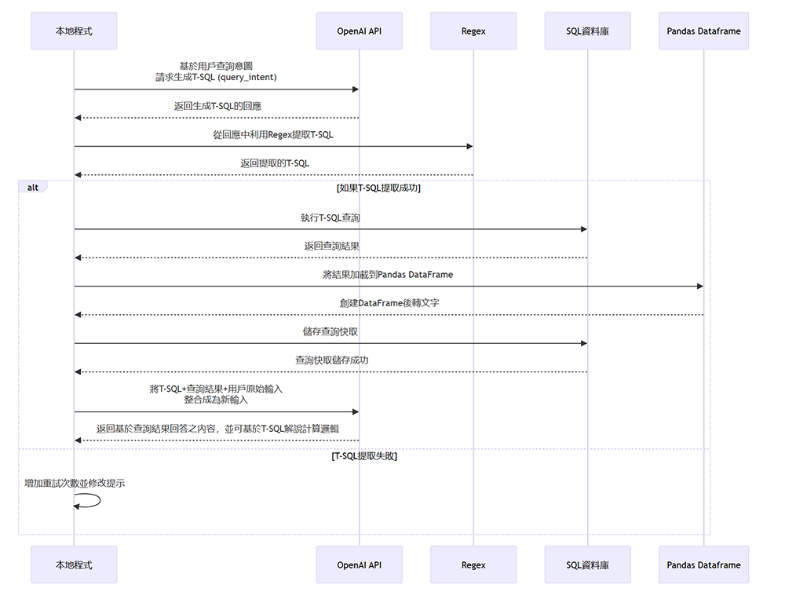

# Example ChatGPT企業運營數據整合

在這個範例中，將會示範如何將企業內部數據與ChatGPT無縫整合。在過去，一想到要將AI與企業內部知識整合，第一個想到的就是finetune，但實務上finetune不但需要耗費時間精神準備數據與標註數據，同時還需要專業人才以及算力。耗費那個多人力物力結果得到什麼，首先企業內部數據有教過的部分也許是回答得還算順暢，但是面對營運數據或kpi，這種每日甚至於實時的變動，根本不可能用finetune來實現，更別提數字類的你要ChatGPT背下來，它恐怕只會還以一堆幻覺。更別提機器學習的通病「災難性的遺忘」，學了新的忘了舊的，也許學到了企業內部知識，但可能原本的語言能力也會受到傷害。

## 架構

那有甚麼好方法可以整合企業內數據(尤其是實時數據)與ChatGPT呢，在這個範例我們將透過ChatGPT的tool calls功能動態選擇工具，當偵測到使用者的輸入有想要獲得資料庫查詢結果或者是彙總報表與相關欄位的意圖時。ChatGPT就會以tool calls的方式來告知前一個問句命中到了特定工具，而在這個實作中我們將會開發一個名為query_sql函數(位於 prompt4all/tools/database_tools.py )來作為工具，而引數正是使用者想要獲得數據的意圖。

在獲取用戶意圖後，這個query_sql函數首先會將使用者取得數據的意圖，搭配資料庫的schema文件，讓ChatGPT根據文件來編寫出有效的T-SQL語法，這步驟正是Text2SQL，然後再將語法發查資料庫，將查回來的數據表編寫成tab分隔的字串，查詢資料庫的T-SQL以及用戶的原始問句，將這三者整合為一後，ChatGPT就能針對查詢資料庫的數據做深入的洞察與解析。也能根據之前生成出來的T-SQL來回答關於計算邏輯的問題。

## 場景

## 安裝

1. 需安裝SQL Server 2022
2. 請於此連結處下載並還原 [AdventureWorksDW2022.bak](https://github.com/Microsoft/sql-server-samples/releases/download/adventureworks/AdventureWorksDW2022.bak)，這是我們範例的查詢資料庫。

## 使用自己的數據

1. 修改

