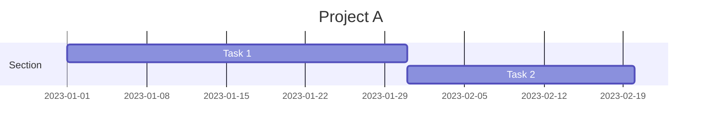

### 創建甘特圖的指南:

* 甘特圖以關鍵字`gantt`開始，接著是軸和任務的定義。
* 注意：
  * 不要在部分名稱中使用`:`，而應使用其他字符，如`-`。
  * 不要在部分名稱、任務或任務描述中使用`;`、`\`、`|`、`/`，而應使用其他字符，如`-`。
  * 如果用戶提供的文本中包含`:`，則將其更改為`-`。

### 簡單甘特圖示例:



### 關鍵元素:

* `title` — 圖表的標題。
* `dateFormat` — 圖表中使用的日期格式。
* `section` — 圖表中任務的部分或類別。
* 任務描述 — 包括任務名稱、標識符、開始日期和持續時間。

### 持續時間和依賴關係:

* 任務的持續時間以天（30d）、週（5w）、月（2m）或小時（40h）指定。
* 任務之間的依賴關係使用`after`後跟當前任務所依賴的任務標識符來表示。

### 附加參數:

* `excludes` — 從時間表中排除的天數（例如，週末或假期）。
* `todayMarker` — 圖表上當前日期的標記。
* `sectionLabels` — 部分的標籤。

### Milestones

請注意，除了有持續時間的任務之外，甘特圖上還會以許多**單一時間點**的事件，我們稱之為milestone。所以不清楚持續期間的事件，都請以發生時點以milestone形式來成呈現在圖中

**mermaid**

```mermaid
gantt
dateFormat HH:mm
axisFormat %H:%M
Initial milestone : milestone, m1, 17:49, 2m
Task A : 10m
Task B : 5m
Final milestone : milestone, m2, 18:08, 4m
```已使用 **Diagrams: Show Me**


當`diagramType`為`gantt`（甘特圖）時，`get_DiagramGuidelinesRoute`的指南內容如下：

### 創建甘特圖的指南:

* 甘特圖以關鍵字`gantt`開始，接著是軸和任務的定義。
* 注意：
  * 不要在部分名稱中使用`:`，而應使用其他字符，如`-`。
  * 不要在部分名稱、任務或任務描述中使用`;`、`\`、`|`、`/`，而應使用其他字符，如`-`。
  * 如果用戶提供的文本中包含`:`，則將其更改為`-`。

### 簡單甘特圖示例:

<pre><div class="bg-black rounded-md"><div class="flex items-center relative text-gray-200 bg-gray-800 dark:bg-token-surface-primary px-4 py-2 text-xs font-sans justify-between rounded-t-md"><span>mermaid</span><button class="flex gap-1 items-center"><svg width="24" height="24" viewBox="0 0 24 24" fill="none" xmlns="http://www.w3.org/2000/svg" class="icon-sm"><path fill-rule="evenodd" clip-rule="evenodd" d="M12 4C10.8954 4 10 4.89543 10 6H14C14 4.89543 13.1046 4 12 4ZM8.53513 4C9.22675 2.8044 10.5194 2 12 2C13.4806 2 14.7733 2.8044 15.4649 4H17C18.6569 4 20 5.34315 20 7V19C20 20.6569 18.6569 22 17 22H7C5.34315 22 4 20.6569 4 19V7C4 5.34315 5.34315 4 7 4H8.53513ZM8 6H7C6.44772 6 6 6.44772 6 7V19C6 19.5523 6.44772 20 7 20H17C17.5523 20 18 19.5523 18 19V7C18 6.44772 17.5523 6 17 6H16C16 7.10457 15.1046 8 14 8H10C8.89543 8 8 7.10457 8 6Z" fill="currentColor"></path></svg>Copy code</button></div><div class="p-4 overflow-y-auto"><code class="!whitespace-pre hljs language-mermaid">gantt
  title Project A
  dateFormat  YYYY-MM-DD
  section Section
  Task 1           :a1, 2023-01-01, 30d
  Task 2           :after a1  , 20d
</code></div></div></pre>

### 關鍵元素:

* `title` — 圖表的標題。
* `dateFormat` — 圖表中使用的日期格式。
* `section` — 圖表中任務的部分或類別。
* 任務描述 — 包括任務名稱、標識符、開始日期和持續時間。

### 持續時間和依賴關係:

* 任務的持續時間以天（30d）、週（5w）、月（2m）或小時（40h）指定。
* 任務之間的依賴關係使用`after`後跟當前任務所依賴的任務標識符來表示。

### 附加參數:

* `excludes` — 從時間表中排除的天數（例如，週末或假期）。
* `todayMarker` — 圖表上當前日期的標記。
* `sectionLabels` — 部分的標籤。
```

## Setting dates[](https://mermaid.js.org/syntax/gantt.html#setting-dates)

`dateFormat` defines the format of the date **input** of your gantt elements. How these dates are represented in the rendered chart **output** are defined by `axisFormat`.

### Input date format[](https://mermaid.js.org/syntax/gantt.html#input-date-format)

The default input date format is `YYYY-MM-DD`. You can define your custom `dateFormat`.

**markdown**

```
dateFormat YYYY-MM-DD
```

The following formatting options are supported:

| Input      | Example        | Description                                            |
| ---------- | -------------- | ------------------------------------------------------ |
| `YYYY`     | 2014           | 4 digit year                                           |
| `YY`       | 14             | 2 digit year                                           |
| `Q`        | 1..4           | Quarter of year. Sets month to first month in quarter. |
| `M MM`     | 1..12          | Month number                                           |
| `MMM MMMM` | January..Dec   | Month name in locale set by`dayjs.locale()`            |
| `D DD`     | 1..31          | Day of month                                           |
| `Do`       | 1st..31st      | Day of month with ordinal                              |
| `DDD DDDD` | 1..365         | Day of year                                            |
| `X`        | 1410715640.579 | Unix timestamp                                         |
| `x`        | 1410715640579  | Unix ms timestamp                                      |
| `H HH`     | 0..23          | 24 hour time                                           |
| `h hh`     | 1..12          | 12 hour time used with`a A`.                           |
| `a A`      | am pm          | Post or ante meridiem                                  |
| `m mm`     | 0..59          | Minutes                                                |
| `s ss`     | 0..59          | Seconds                                                |
| `S`        | 0..9           | Tenths of a second                                     |
| `SS`       | 0..99          | Hundreds of a second                                   |
| `SSS`      | 0..999         | Thousandths of a second                                |
| `Z ZZ`     | +12:00         | Offset from UTC as +-HH:mm, +-HHmm, or Z               |

More info in: [https://day.js.org/docs/en/parse/string-format/](https://day.js.org/docs/en/parse/string-format/)

### Output date format on the axis[](https://mermaid.js.org/syntax/gantt.html#output-date-format-on-the-axis)

The default output date format is `YYYY-MM-DD`. You can define your custom `axisFormat`, like `2020-Q1` for the first quarter of the year 2020.

**markdown**

```
axisFormat %Y-%m-%d
```

The following formatting strings are supported:

| Format | Definition                                                                                |
| ------ | ----------------------------------------------------------------------------------------- |
| %a     | abbreviated weekday name                                                                  |
| %A     | full weekday name                                                                         |
| %b     | abbreviated month name                                                                    |
| %B     | full month name                                                                           |
| %c     | date and time, as "%a %b %e %H:%M:%S %Y"                                                  |
| %d     | zero-padded day of the month as a decimal number [01,31]                                  |
| %e     | space-padded day of the month as a decimal number [ 1,31]; equivalent to %\_d             |
| %H     | hour (24-hour clock) as a decimal number [00,23]                                          |
| %I     | hour (12-hour clock) as a decimal number [01,12]                                          |
| %j     | day of the year as a decimal number [001,366]                                             |
| %m     | month as a decimal number [01,12]                                                         |
| %M     | minute as a decimal number [00,59]                                                        |
| %L     | milliseconds as a decimal number [000, 999]                                               |
| %p     | either AM or PM                                                                           |
| %S     | second as a decimal number [00,61]                                                        |
| %U     | week number of the year (Sunday as the first day of the week) as a decimal number [00,53] |
| %w     | weekday as a decimal number [0(Sunday),6]                                                 |
| %W     | week number of the year (Monday as the first day of the week) as a decimal number [00,53] |
| %x     | date, as "%m/%d/%Y"                                                                       |
| %X     | time, as "%H:%M:%S"                                                                       |
| %y     | year without century as a decimal number [00,99]                                          |
| %Y     | year with century as a decimal number                                                     |
| %Z     | time zone offset, such as "-0700"                                                         |
| %%     | a literal "%" character                                                                   |

More info in: [https://github.com/d3/d3-time-format/tree/v4.0.0#locale\_format](https://github.com/d3/d3-time-format/tree/v4.0.0#locale_format)

### Axis ticks (v10.3.0+)[](https://mermaid.js.org/syntax/gantt.html#axis-ticks-v10-3-0)

The default output ticks are auto. You can custom your `tickInterval`, like `1day` or `1week`.

**markdown**

```
tickInterval 1day
```

The pattern is:

**javascript**

```
/^([1-9][0-9]*)(millisecond|second|minute|hour|day|week|month)$/;
```

More info in: [https://github.com/d3/d3-time#interval\_every](https://github.com/d3/d3-time#interval_every)

Week-based `tickInterval`s start the week on sunday by default. If you wish to specify another weekday on which the `tickInterval` should start, use the `weekday` option:

##### Code:

**mermaid**

```
gantt
  tickInterval 1week
  weekday monday
```

