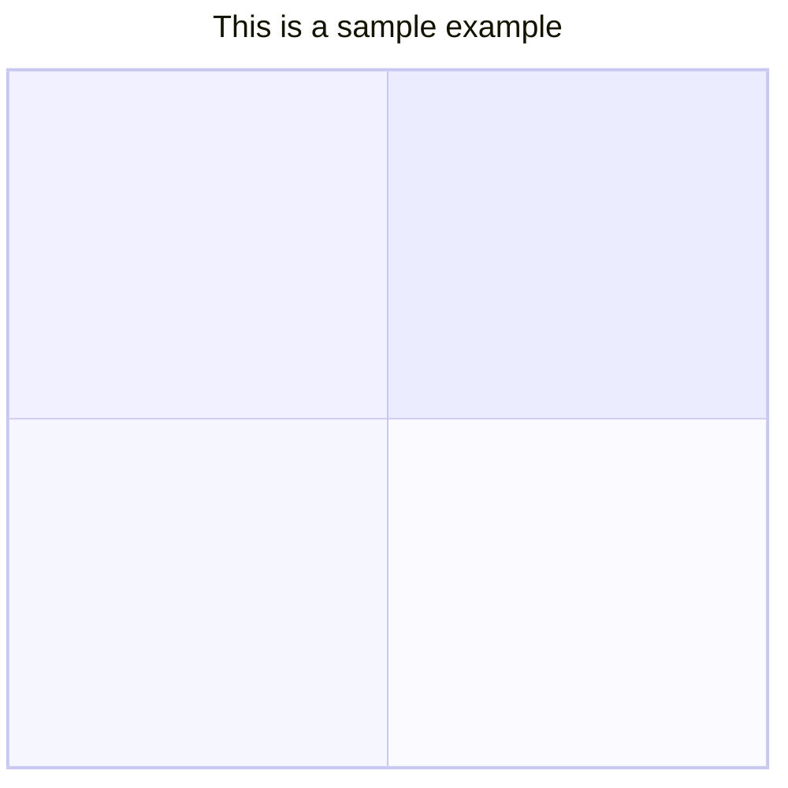

# 象限圖

> 象限圖是數據的可視化表示形式，分為四個象限。它用於在二維網格上繪製數據點，一個變數表示在 x 軸上，另一個變數在 y 軸上表示。象限是通過根據一組特定於所分析數據的標準將圖表分成四個相等的部分來確定的。象限圖通常用於識別數據中的模式和趨勢，並根據圖表中數據點的位置確定操作的優先順序。它們通常用於商業、行銷和風險管理等領域。

## 語法

如果圖表中沒有可用的點，**則軸**文本和象限都將呈現在相應**象限**的中心。如果有點，**x** 軸標籤將從相應象限的左側呈現，它們也將顯示在圖表的底部，**y 軸**標籤將呈現在相應象限的底部，象限文本將呈現在相應象限的頂部。

對於點 x 和 y 值，最小值為 0，最大值為 1。

### 標題

標題是圖表的簡短描述，它將始終呈現在圖表頂部。

### X軸

x 軸確定將在 x 軸中顯示哪些文字。在 x 軸上，左右有兩部分，您可以同時通過兩個部分，也可以只通過左側。語句應以 then 開頭，後跟分隔符 then 。`x-axis``left axis text``-->``right axis text`

1. `x-axis <text> --> <text>`將呈現左軸和右軸文本。
2. `x-axis <text>`僅呈現左軸文本。

### Y軸

y 軸確定在 y 軸中顯示哪些文字。在 y 軸上，頂部和底部有兩個部分，您可以同時通過兩者，也只通過底部。語句應以 then 開頭，後跟分隔符 then 。`y-axis``bottom axis text``-->``top axis text`

1. `y-axis <text> --> <text>`將呈現底部和頂部軸文本。
2. `y-axis <text>`僅呈現底部軸文本。

### 象限文本

確定將在象限內顯示哪些文本。`quadrant-[1,2,3,4]`

1. `quadrant-1 <text>`確定將在右上象限內呈現哪些文本。
2. `quadrant-2 <text>`確定將在左上象限內呈現哪些文本。
3. `quadrant-3 <text>`確定將在左下象限內呈現哪些文本。
4. `quadrant-4 <text>`確定將在右下象限內呈現的文本。

### 點

點用於在象限圖內繪製一個圓。語法在這裡是 x，y 值在 0 - 1 範圍內。`<text>: [x, y]`

1. `Point 1: [0.75, 0.80]`在這裡，點 1 將繪製在右上象限。
2. `Point 2: [0.35, 0.24]`這裡點 2 將繪製在左下象限。

## 圖表配置

| 參數                          | 描述                                                       | 預設值   |
| ----------------------------- | ---------------------------------------------------------- | -------- |
| chartWidth                     | 圖表的寬度                                                 | 500      |
| chartHeight                     | 圖表的高度                                                 | 500      |
| titlePadding                      | 標題的頂部和底部填充                                       | 10       |
| titleFontSize                 | 標題字體大小                                               | 20       |
| quadrantPadding                      | 在所有象限外填充                                           | 5        |
| quadrantTextTopPadding              | 在頂部繪製文字時，象限文本頂部填充（不存在數據點）         | 5        |
| quadrantLabelFontSize              | 象限文字字體大小                                           | 16       |
| quadrantInternalBorderStrokeWidth          | 象限內的邊框描邊寬度                                       | 1        |
| quadrantExternalBorderStrokeWidth | 象限外部邊框描邊寬度                                       | 2        |
| xAxisLabelPadding             | x 軸文字的頂部和底部填充                                   | 5        |
| xAxisLabelFontSize            | X 軸文字字型大小                                           | 16       |
| xAxisPosition                       | x 軸的位置（頂部、底部） 如果有點，則 x 軸將始終呈現在底部 | “頂部” |
| yAxisLabelPadding             | y 軸文本的左右填充                                         | 5        |
| yAxisLabelFontSize            | Y 軸文字字型大小                                           | 16       |
| yAxisPosition                       | y 軸的位置（左、右）                                       | “左”   |
| pointTextPadding              | 點和以下文本之間的填充                                     | 5        |
| pointLabelFontSize            | 點文本字體大小                                             | 12       |
| pointRadius         | 要繪製的點的半徑                                           | 5        |

