# 設計繪製State圖的Mermaid語法指南

# State圖的Mermaid語法指南

## Concept

 State圖用於描述系統的行為，表現為一系列有限的狀態及其轉換。

## State

 狀態圖有以用多種方式宣告`，最簡單的方式是指定一個stateid:

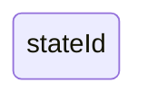

或是利用狀態關鍵字description :

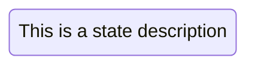

或是透過指定stateid然後冒號再加上description:

## Transitions

* 轉換用箭頭`-->`表示，顯示一個狀態如何變為另一個狀態。

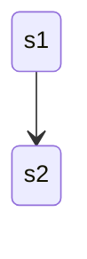

轉換也可以透過加入文字來表達其意義:

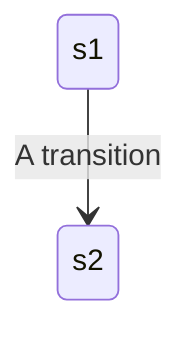

## Start and End

特殊的狀態`[*]`表示圖表的開始或結束。

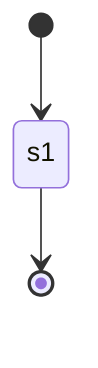

## Composite states

複合狀態包含多個內部狀態

In order to define a composite state you need to use the state keyword followed by an id and the body of the composite state between {}. See the example below:\

* 不能在不同複合狀態的內部狀態之間定義轉換。

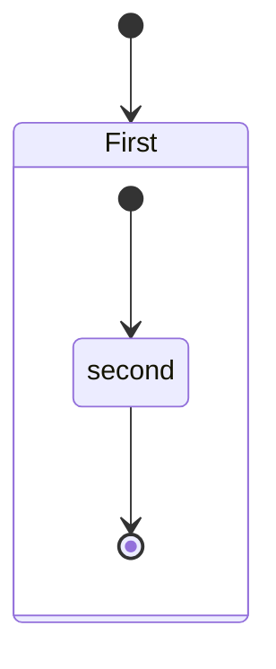

You can do this in several layers:

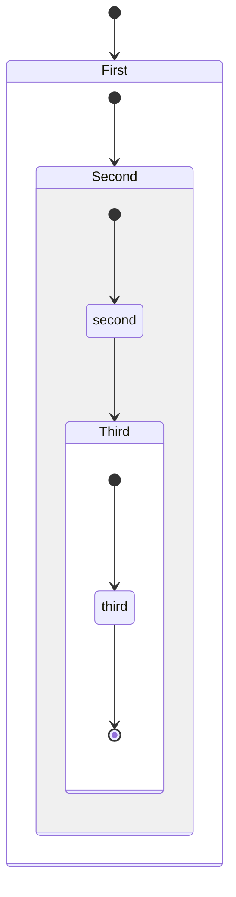

You can also define transitions also between composite states:

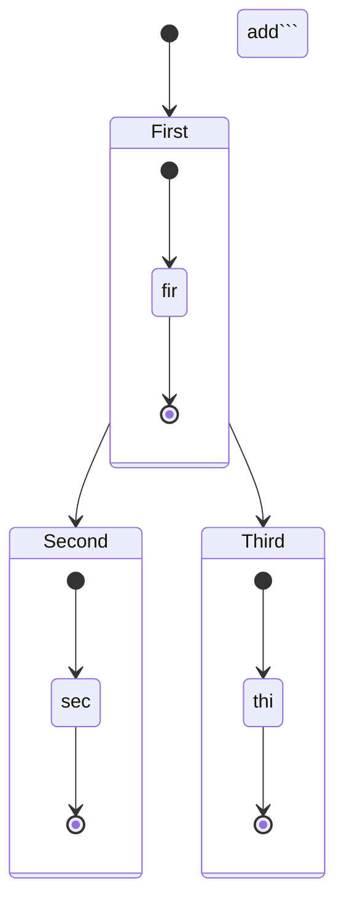

*You can not define transitions between internal states belonging to different composite states*

## Choice

有時需要在兩條或多條路徑之間進行選擇，可以使用`<<choice>>`來實現。

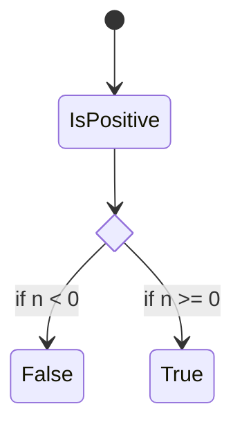

## Forks

It is possible to specify a fork in the diagram using <<fork>> <<join>>.

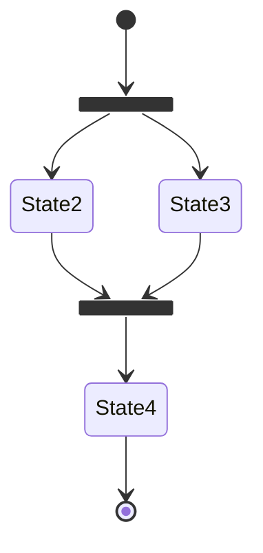

## Notes

Sometimes nothing says it better than a Post-it note. That is also the case in state diagrams.

7. **​分支（Forks）和合並（Joins）​**​:
   * 使用`<<fork>>`和`<<join>>`關鍵字來指定圖表中的分支和合並。
8. **註釋**​:
   * 可以將註釋放在節點的左邊或右邊。
   * 使用`%%`作為註釋的開頭，註釋將被解析器忽略。
9. **​並行性（Concurrency）​**​​:
   * 使用`--`符號來指定並行。
10. **設定圖表方向**​​:

* 使用`direction`語句來設定圖表的渲染方向。

11. **​樣式定義（Class Definitions）​**​​:

* 使用`classDef`關鍵字來定義風格，並使用`class`關鍵字或`:::`操作符將風格應用於狀態。
* 目前無法對開始或結束狀態以及複合狀態內部應用風格。

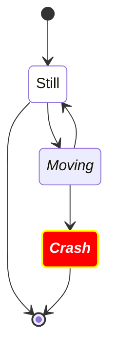

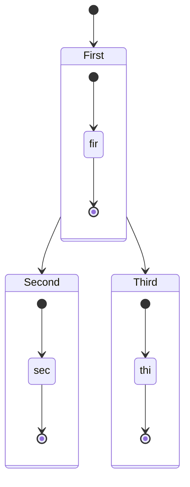

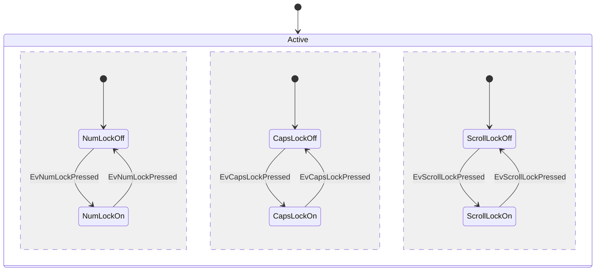

12. **狀態名中的空格**​:

* 首先使用標識符定義狀態，然後在圖表中引用此標識符來添加空格。

### Mermaid主題選擇:

